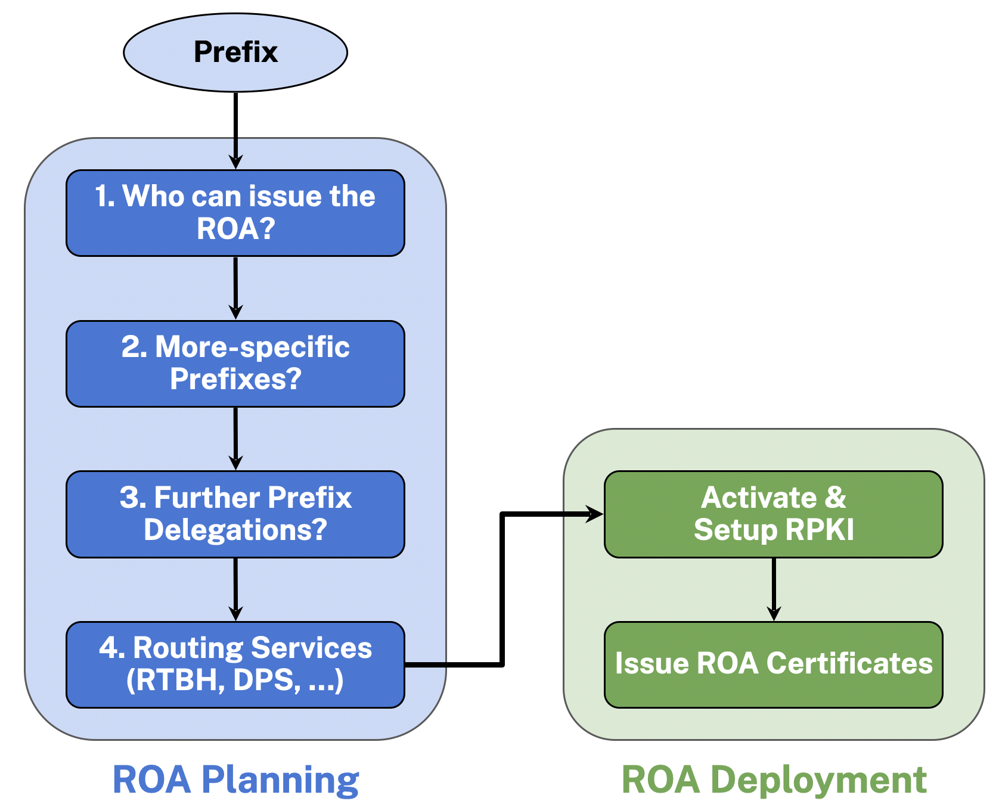

# ru-RPKI-ready
This repository contains the dataset for the paper "ru-RPKI-ready: the Road Left to Full ROA Adoption" by Deepak Gouda, Romain Fontugne and Cecilia Testart, published in ACM Internet Measurement Conference (IMC) 2025. The dataset provides essential information regarding routed IPv4 and IPv6 prefixes that enables researchers and operators to follow the RPKI planning and deployment framework proposed in the paper. For more details regarding the framework, refer to the [paper](https://deepakgouda.github.io/assets/pdf/IMC-2025-ru-RPKI-ready.pdf).

[](https://doi.org/10.5281/zenodo.17237911)

## Downloading the Latest Release
To download the latest release of ru-RPKI-ready, you can use the following command in your terminal:

If you do not have Git LFS installed, please refer to the [Git LFS installation guide](https://git-lfs.github.com/) before proceeding.

```bash
git clone git@github.com:ISS-GT/ru-RPKI-ready.git
cd ru-RPKI-ready/data
git lfs pull
```

## Using the dataset in Python
To load and use the dataset in Python, you can use the following code snippet:

```
>>> import pandas as pd
>>> data = pd.read_parquet("data/prefix_tags_2025-04-01_v4.parquet")
>>> data[data.prefix == "208.186.48.0/20"].iloc[0]
prefix                                                             208.186.48.0/20
af                                                                               4
RIR                                                                           ARIN
RPKI Issuing Authority                                  Allstream Business US, LLC
Authoritative Allocation Type                                           ALLOCATION
Customer Organization(s)                                              [101netlink]
Customer Allocation Type(s)                                         [REALLOCATION]
RPKI Status                                                               NotFound
RPKI Certificate                 46:CD:B7:E7:87:A9:20:32:5B:E6:E3:AA:56:58:59:C...
Origin ASN                                                                   21541
ASN Organization Name                                                   101netlink
Tag List                         [ROA Not Found, Certified, Reassigned, Diff SK...
```

### Dataset Description
- RPKI Issuing Authority: The organization with the authority to issue RPKI certificates and ROAs for the prefix.
- Authoritative Allocation Type: The type of allocation held by the RPKI issuing authority (e.g., `ALLOCATION`, `ALLOCATED PA`).
- Customer Organization(s): The customer organizations holding further reallocations for the prefix.
- Customer Allocation Type(s): The type of allocations held by the customer organizations (e.g., `REALLOCATION`, `ASSIGNED PA`).
- RPKI Status: The RPKI status of the prefix (e.g., `Valid`, `NotFound`, `Invalid` or `Invalid,more-specific`).
- RPKI Certificate: The RPKI certificate containing the prefix, which can be used to issue ROAs.
- Origin ASN: The Autonomous System Number (ASN) originating the prefix in BGP.
- ASN Organization Name: The name of the organization associated with the origin ASN.
- Tag List: A list of tags associated with the prefix.

## RPKI Issuing Framework
To understand the RPKI issuing framework proposed in the paper, please refer to [Section 5: Facilitating ROA Planning](https://deepakgouda.github.io/assets/pdf/IMC-2025-ru-RPKI-ready.pdf) in the paper. Here is the proposed framework diagram for reference:




## Citation
If you use the ru-RPKI-ready dataset in your research, please cite the following dataset:

```bibtex
@software{gouda_2025_17237911,
  author       = {Gouda, Deepak and
                  Fontugne, Romain and
                  Testart, Cecilia},
  title        = {ru-RPKI-ready: the Road Left to Full ROA Adoption},
  month        = sep,
  year         = 2025,
  publisher    = {Zenodo},
  version      = {v1.0},
  doi          = {10.5281/zenodo.17237911},
  url          = {https://doi.org/10.5281/zenodo.17237911},
  swhid        = {swh:1:dir:4f242fe42650abe1e8111f269f9fe28d6e40689c
                   ;origin=https://doi.org/10.5281/zenodo.17237911;vi
                   sit=swh:1:snp:3ae16424e511de0aeee515fb7deeca891e8d
                   d2e5;anchor=swh:1:rel:10a383ce82e6fd46175370803829
                   4d6edd526380;path=ISS-GT-ru-RPKI-ready-8c1ebd5
                  },
}
```

If you use find the framework present in the paper useful, please cite the paper:
```bibtex
@inproceedings{10.1145/3730567.3764452,
    author = {Gouda, Deepak and Fontugne, Romain and Testart, Cecilia},
    title = {ru-RPKI-ready: the Road Left to Full ROA Adoption},
    year = {2025},
    isbn = {9798400718601},
    publisher = {Association for Computing Machinery},
    address = {New York, NY, USA},
    url = {https://doi.org/10.1145/3730567.3764452},
    doi = {10.1145/3730567.3764452},
    abstract = {Resource Public Key Infrastructure (RPKI) has emerged as a standard for enhancing the security of Internet routing. Currently, more than 50% BGP prefixes are covered by RPKI Route Origin Authorizations (ROAs), enabling networks to validate the origin of prefix advertisements in BGP. Despite this progress, ROA adoption remains non-uniform, with key stakeholders encountering significant barriers in the adoption process. In this paper, we combine a product adoption framework with data-driven analysis of global RPKI adoption to identify persistent disparities and pinpoint the stages of the adoption process that hinder broader growth. Our study reveals that, although RPKI awareness has grown, the complexity of planning and deploying ROAs remains a significant challenge. Since no unified workflow and documentation exist for ROA planning, many organizations are left without clear operational guidance. To address this challenge, we propose a systematic framework for ROA planning and introduce ru-RPKI-ready, a platform designed to provide data and insights to facilitate ROA planning. Using ru-RPKI-ready, we characterize the routed address space not covered by RPKI ROAs. We find that 47% IPv4 and 71% IPv6 prefixes not in RPKI could be covered with minimal technical effort. Our analysis also reveals that if as few as ten organizations were to take the necessary actions, the global ROA coverage could increase by 7% for IPv4 and 19% for IPv6.},
    booktitle = {Proceedings of the 2025 ACM Internet Measurement Conference},
    pages = {415–429},
    numpages = {15},
    keywords = {Product Adoption Process, Routing Security, RPKI, ROA Planning},
    location = {USA},
    series = {IMC '25}
}
```